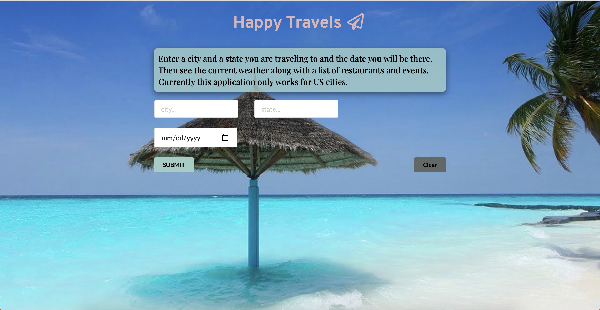

# Happy Travel

A simple search application that gives user information on local restaurants, events, and weather based on location!

## Motivation

our motivation when building this application was to encourage more people to consider traveling with out any fear or doubts of having a fulfilling trip. Our group was focused on giving users a reliable and simple way to lookup local information in the fastest and most efficient way possible.  

## Getting Started

very easy to use, just type in your city and state and see your results!

 
## Technologies

* [HTML](https://developer.mozilla.org/en-US/docs/Web/HTML)
* [CSS](https://developer.mozilla.org/en-US/docs/Web/CSS)
* [Javascript](https://developer.mozilla.org/en-US/docs/Web/JavaScript)

## Deployed Link

* [See Live Site](https://fanuelalem.github.io/happytravel/)

## Authors

Fanuel Alem,
Aaron Hill,
Steph Kuo,
Erik Schultz

 

See also the list of [contributors]( https://github.com/erikvschultz/happytravel/graphs/contributors) who participated in this project.

## License

This project is licensed under the MIT License 

## Acknowledgments

* professorHat tip to anyone whose code, libraries, packages, or UI was used  / inspired from
* teacher assistants